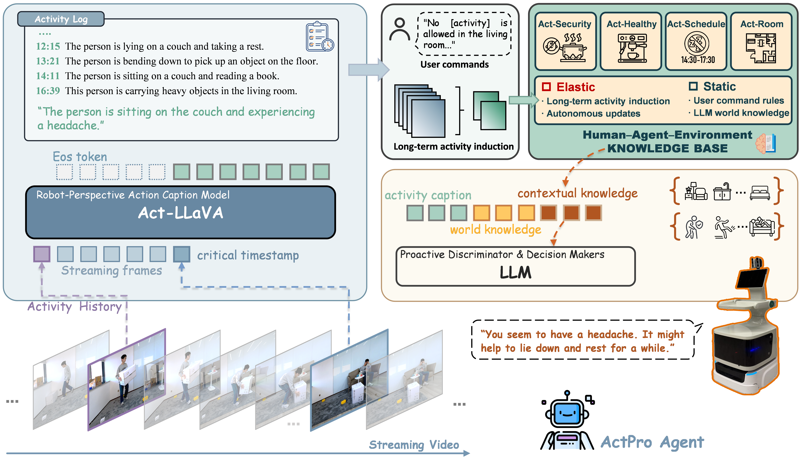

# ActPro



ActPro is an activity-driven proactive agent framework for smart-home understanding and proactive response. This release contains two connected parts:

- `Act-LLaVA`: the video activity understanding component, released with
  training, preprocessing, inference, and GPT-based semantic evaluation scripts
  for ASTime and PKUMMD.
- `HomeActEval`: a proactive smart-home benchmark with structured knowledge,
  historical activity logs, final model outputs, metrics, response-quality
  scores, and evaluation code.


## Repository Layout

```text
ActPro-Release/
|-- README.md
|-- LICENSE
|-- requirements.txt
|-- .env.example
|-- docs/
|-- Act-LLaVA/
|   |-- checkpoints/
|   |-- data/
|   |-- dataset/
|   |-- demo/
|   |-- eval/
|   |-- models/
|   |-- scripts/
|   `-- tools/
`-- HomeActEval/
    |-- knowledgeBase/
    |-- six_months/
    |-- proactive_code/
    `-- results/
```

## Installation

The released checkpoints were tested in a `llavaNEXT` conda environment with
Python 3.10, PyTorch 2.1.2, TorchVision 0.16.2, and CUDA 12.1.

```bash
conda create -n actpro python=3.10 -y
conda activate actpro

conda install -y \
  pytorch==2.1.2 torchvision==0.16.2 torchaudio pytorch-cuda=12.1 \
  -c pytorch -c nvidia

pip install -r requirements.txt
```

`requirements.txt` installs the external LLaVA-NeXT / LLaVA-OneVision codebase
used by this project. The local code imports it as `llava`, including:

```text
llava.model.builder.load_pretrained_model
llava.mm_utils.process_images
llava.mm_utils.image_token_generation
```

Install FFmpeg and make it available as `ffmpeg` in `PATH`, as
`Act-LLaVA/ffmpeg/ffmpeg`, or through:

```bash
export FFMPEG_BIN=/path/to/ffmpeg
```

For GPT-based evaluation, set the OpenAI key with an environment variable. The
default base URL is the official OpenAI endpoint.

```bash
export OPENAI_API_KEY=...
export OPENAI_BASE_URL=https://api.openai.com/v1
```

You can also use `.env.example` as a template for local environment variables.
Do not commit `.env`.

## Model Weights

ActPro uses PEFT/LoRA adapters on top of:

```text
lmms-lab/llava-onevision-qwen2-7b-ov
```

The released adapter names are:

```text
ActLLaVA-ASTime
ActLLaVA-PKUMMD
```

Download the released adapters from Hugging Face:

- ActLLaVA-ASTime: 🤗 [Jambo1988/ActLLaVA](https://huggingface.co/Jambo1988/ActLLaVA)
- ActLLaVA-PKUMMD: 🤗 [Jambo1988/ActLLaVA](https://huggingface.co/Jambo1988/ActLLaVA)

After downloading the adapters, place them at:

```text
Act-LLaVA/checkpoints/ActLLaVA-ASTime
Act-LLaVA/checkpoints/ActLLaVA-PKUMMD
```

or point the scripts to the adapter locations with `CKPT=...`.

The local adapter bundles contain `adapter_model.safetensors`, tokenizer files,
and `adapter_config.json`. The `.safetensors` files are larger than GitHub's
normal 100 MB file limit and are ignored by `.gitignore`; host them on Hugging
Face rather than committing them to GitHub.

See [docs/MODEL_ZOO.md](docs/MODEL_ZOO.md) for checkpoint details.

## Datasets

Download ASTime from Hugging Face:🤗
[ASTime Dataset](https://huggingface.co/datasets/Jambo1988/ASTime)


This repository includes the ASTime annotation JSON files used by the released
scripts:

```text
Act-LLaVA/dataset/ASTime/annotations/train.json
Act-LLaVA/dataset/ASTime/annotations/test/*.json
```

PKUMMD videos should be prepared from 
[ECHO960/PKU-MMD](https://github.com/ECHO960/PKU-MMD). This repository
includes the PKUMMD annotations used by the released scripts:

```text
Act-LLaVA/dataset/PKUMMD/annotations/all_v1.json
Act-LLaVA/dataset/PKUMMD/annotations/test.json
```

Expected generated feature paths:

```text
Act-LLaVA/dataset/ASTime/features/<video_key>.pt
Act-LLaVA/dataset/PKUMMD/features/<video_key>.pt
```

Pre-extracted features are not included. Users should generate them locally with
the preprocessing scripts below.

## ASTime Pipeline

The released `ActLLaVA-ASTime` model uses this preprocessing:

- sample videos to 2 FPS;
- keep the original video resolution during video sampling;
- extract LLaVA-OneVision/SigLIP visual features;
- save features as `bfloat16` `.pt` tensors under
  `Act-LLaVA/dataset/ASTime/features`.

From raw ASTime training videos:

```bash
cd Act-LLaVA

SRC_RAW=/path/to/ASTime/raw/train/videos \
bash scripts/ASTime_preprocess_train.sh 0
```

From an already prepared flat 2 FPS training-video directory:

```bash
cd Act-LLaVA

SRC_2FPS=/path/to/flat/2fps/train/videos \
bash scripts/ASTime_preprocess_train.sh 0
```

Train with the released setting:

```bash
cd Act-LLaVA

OUTPUT_DIR=output/ActLLaVA-ASTime \
bash scripts/ASTime_train.sh
```

Key released settings:

```text
LAMBDA=0.1
TRAIN_DATASETS=xdu_clip_stream_train
LLM_PRETRAINED=lmms-lab/llava-onevision-qwen2-7b-ov
OUTPUT_DIR=output/ActLLaVA-ASTime
NUM_GPUS=3
```

The released training setup uses three GPUs by default. Adjust `NUM_GPUS` for
your hardware.

Run inference and GPT semantic evaluation:

```bash
cd Act-LLaVA

export OPENAI_API_KEY=...
RESULT_DIR=dataset/ASTime/results_ActLLaVA_ASTime \
bash scripts/ASTime_test.sh
```

Key evaluation settings:

```text
CKPT=checkpoints/ActLLaVA-ASTime
DATA_PATH=dataset/ASTime/videos/test
RESULT_DIR=dataset/ASTime/results_ActLLaVA_ASTime
LAB_FOLDER=dataset/ASTime/annotations/test
TIME_MODE=astime_window
THRESHOLD=4
GPT_EVAL_MODEL=gpt-4o
```

Evaluate an existing ASTime prediction folder directly:

```bash
python eval/astime_gpt_semantic_eval.py \
  --pre_folder dataset/ASTime/results_ActLLaVA_ASTime \
  --lab_folder dataset/ASTime/annotations/test \
  --time_mode astime_window \
  --threshold 4 \
  --model gpt-4o \
  --cache_path dataset/ASTime/gpt_semantic_cache.jsonl \
  --output_json dataset/ASTime/results_ActLLaVA_ASTime_gpt_eval.json
```

More detail: [docs/ASTIME_PREPROCESSING.md](docs/ASTIME_PREPROCESSING.md).

## PKUMMD Pipeline

The released `ActLLaVA-PKUMMD` model uses a different preprocessing path:

- sample videos to 2 FPS;
- center-crop each frame to the largest square region;
- resize the crop to 384x384;
- extract LLaVA-OneVision/SigLIP visual features;
- save features as `bfloat16` `.pt` tensors under
  `Act-LLaVA/dataset/PKUMMD/features`.

From raw PKUMMD videos:

```bash
cd Act-LLaVA

SRC_RAW=/path/to/PKUMMD/raw/videos \
bash scripts/PKUMMD_preprocess_train.sh 0
```

From an already prepared flat 384/2FPS directory:

```bash
cd Act-LLaVA

SRC_2FPS_384=/path/to/flat/pkummd/384_2fps/videos \
bash scripts/PKUMMD_preprocess_train.sh 0
```

Train with the released setting:

```bash
cd Act-LLaVA

OUTPUT_DIR=output/ActLLaVA-PKUMMD \
bash scripts/PKUMMD_train.sh
```

Key released settings:

```text
PKU_TRAIN_JSON=all_v1.json
TRAIN_DATASETS=pku_clip_stream_train
STREAM_LOSS_WEIGHT=0.2
LLM_PRETRAINED=lmms-lab/llava-onevision-qwen2-7b-ov
OUTPUT_DIR=output/ActLLaVA-PKUMMD
NUM_GPUS=3
```

The released training setup uses three GPUs by default. Adjust `NUM_GPUS` for
your hardware.

Run inference and GPT semantic evaluation:

```bash
cd Act-LLaVA

export OPENAI_API_KEY=...
bash scripts/PKUMMD_test.sh
```

Key evaluation settings:

```text
CKPT=checkpoints/ActLLaVA-PKUMMD
DATA_PATH=dataset/PKUMMD/videos/test
RESULT_DIR=dataset/PKUMMD/results_ActLLaVA_PKUMMD
GT_PATH=dataset/PKUMMD/annotations/test.json
GPT_EVAL_MODEL=gpt-4o
```

The released PKUMMD GPT semantic result from the research run was:

```text
Macro Average: P=0.8081, R=0.8348, F1=0.8166
Micro Average: P=0.8032, R=0.8311, F1=0.8169
Counts: TP=2155, FP=528, FN=438, unknown_fp=2
```

More detail: [docs/PKUMMD_PREPROCESSING.md](docs/PKUMMD_PREPROCESSING.md).

## HomeActEval

HomeActEval is the proactive smart-home evaluation package released with
ActPro. It includes:

```text
HomeActEval/knowledgeBase/
HomeActEval/six_months/
HomeActEval/results/
HomeActEval/proactive_code/
```

The benchmark evaluates proactive decisions under three settings:

```text
raw_logs_context = current event + recent raw historical activity memory
static_kb        = current event + recent raw memory + retrieved static rules
full_kb          = current event + recent raw memory + retrieved static rules + retrieved habit KB
```

Run a dry run without API calls:

```bash
cd HomeActEval

python proactive_code/run_experiment.py \
  --model deepseek_r1 \
  --setting full_kb \
  --dry-run
```

Recompute released decision metrics:

```bash
cd HomeActEval

python proactive_code/evalute_proactive.py --output-root results
```

See [HomeActEval/README.md](HomeActEval/README.md) for the full benchmark
layout, model/provider configuration, output schema, decision metrics,
response-quality scoring, and released result files.

## License

This project is released under the [Apache License 2.0](LICENSE).
