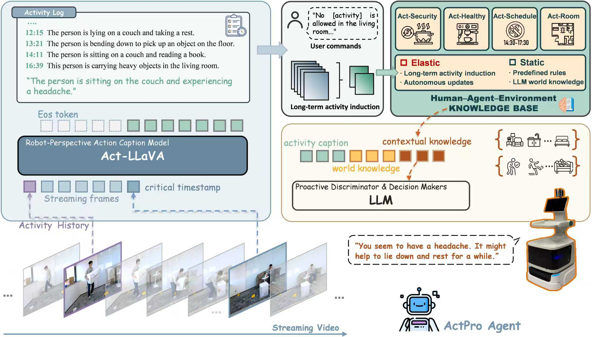

# Activity-driven Proactive Agent for Smart Home Environments

This repository contains the implementation of the paper:  
**"Activity-driven Proactive Agent for Smart Home Environments"**

## 🏗️ Framework

*Figure 1: The architecture of the proposed Activity-driven Proactive Agent.*

## 🚀 Key Features
* **Activity-driven Reasoning:** Leveraging semantic transitions to drive agent proactivity.
* **Act-LLaVA Model:** Optimized for fine-grained temporal action understanding.

[🤗 Datasets](https://huggingface.co/datasets/Jambo1988/ASTime)

